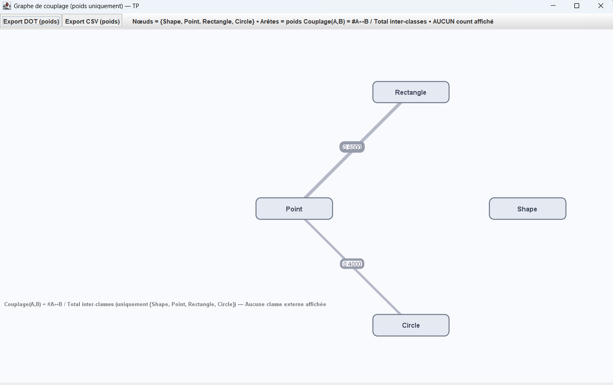
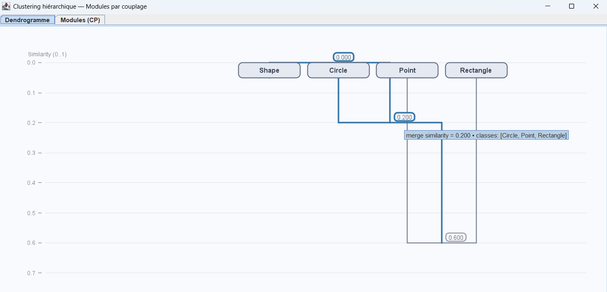

# Static Analysis and CallGraph and Coupling Graphe Java
# TP 1 – TP 2

## 1️. Cloner le dépôt
```bash
git clone https://github.com/Imene-Amirat/StaticAnalysis_CallGraph_CouplingGraph.git
cd StaticAnalysis_CallGraph_CouplingGraph
```

## 2️. Ouvrir le projet dans un IDE

  1. Ouvrir le projet dans IntelliJ IDEA ou Eclipse.
  2. Vérifier que le JDK 17 (ou supérieur) est bien configuré.
  3. S’assurer que le dossier source est src/main/java.

## 3. Points d’exécution principaux

### App.java — Question 1 : Statistiques
- **But :**  
Afficher les **métriques globales** du code source (nombre de classes, méthodes, lignes de code, attributs, top 10 %, etc.).


- **Exécution :**
  - Lancer la classe 
  - Une interface Swing s’ouvre avec des **boutons latéraux Q1 → Q13**.  
  - Chaque bouton correspond à une **question d’analyse** 
  

- **Utilisation :**  
Cliquez sur chaque bouton (Q1 à Q13) pour afficher la réponse correspondante dans la zone “Résultats”.


- **Sortie :**  
Affichage clair des métriques dans une interface Swing.

### CallGraphGuiApp.java — Question 2 : Graphe d’appel
- **But :**  
Afficher le **graphe d’appel orienté** représentant les relations entre les méthodes du projet analysé.


- **Exécution :**
  - Lancer la classe
  - Une **fenêtre Swing** s’ouvre 
  - chaque **nœud** représente une méthode (`Class#method`)
  - les **flèches orientées** montrent les appels entre méthodes
  - les **méthodes externes** (`<external>#...`) sont grisées
  - la méthode **`ext#sqrt`** est surlignée en doré.


- **Sortie :**  
Une visualisation interactive du graphe d’appel.

### CouplingGraphGuiApp.java — Exercice 1 TP2
- **But :**  
  Calculer et visualiser la force de couplage entre classes à partir du graphe d’appel.


- **Exécution :**
  - Lancer GrapheCouplageApp.java
  - Le programme construit un graphe pondéré entre classes selon la formule :
  - Une **fenêtre Swing** s’ouvre
  - chaque **nœud** représente une méthode (`Class`)


- **Sortie :**
  - Graphe Swing affichant :
    - Les classes (Shape, Circle, Rectangle, Point)
    - Les arêtes pondérées (0.4, 0.6, etc.)
    - Couplage élevé ⇒ arête plus épaisse

### ClusteringGuiApp.java — Exercice 2 TP2
- **But :**  
  Identifier les groupes de classes couplées (modules) en appliquant un clustering hiérarchique sur la matrice des couplages.


- **Exécution :**
    - Lancer ClusteringGuiApp.java
    - L’application affiche deux onglets :
      - Dendrogramme : représentation hiérarchique des regroupements
      - Modules (CP) : affichage des modules détectés selon un seuil de couplage CP


## 4. Exemple de Statistique & graphe d'appel :




